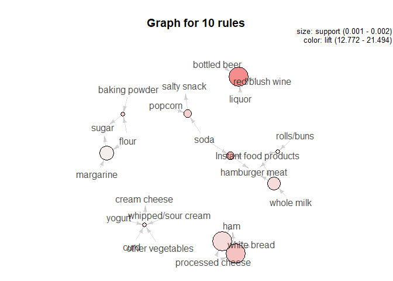

Association rule mining is a very interesting and important topic in
retail analytics.Being able to find the associations between various
products or services is the first step towards providing personalized
recommendations.  
Apriori is one of the famous algorithms that is generally used for
creating association rules and is also used for creating association
rules for this problem.

Steps followed to create the association rules

1.Data pre processing  
2.Running the apriori algorithm  
3.Visualization of the Output

Let's create the rules that will help in identifying the associations

    library('R.utils')
    library(arules)
    library(arulesViz)
    library(grid)
    ## File
    file <- "groceries.txt"

    temp = read.delim2(file, header = FALSE, sep = "\t", dec = ",")
    n = dim(temp)[1]

    temp$lists = strsplit(as.character(temp$V1),",")
    temp <- tibble::rowid_to_column(temp, "ID")

    df = data.frame(ID=integer(),
                    items=character())

    for (i in 1:n) {
    k = data.frame(ID=i, y=temp[i,3])
    names(k) = c('ID','items')
    df = rbind(df,k)
    }

    # Turn ID into a factor
    df$user = factor(df$ID)
    items = split(x=df$items, f=df$ID)

    ## Remove duplicates ("de-dupe")
    items = lapply(items, unique)

    ## Cast this variable as a special arules "transactions" class.
    itemtrans = as(items,"transactions")

    # Now run the 'apriori' algorithm
    # Look at rules with support > .005 & confidence >.1 & length (# artists) <= 5
    itemrules = apriori(itemtrans, 
                         parameter=list(support=.001, confidence=.4, maxlen=10))

    ## Apriori
    ## 
    ## Parameter specification:
    ##  confidence minval smax arem  aval originalSupport maxtime support minlen
    ##         0.4    0.1    1 none FALSE            TRUE       5   0.001      1
    ##  maxlen target   ext
    ##      10  rules FALSE
    ## 
    ## Algorithmic control:
    ##  filter tree heap memopt load sort verbose
    ##     0.1 TRUE TRUE  FALSE TRUE    2    TRUE
    ## 
    ## Absolute minimum support count: 9 
    ## 
    ## set item appearances ...[0 item(s)] done [0.00s].
    ## set transactions ...[169 item(s), 9835 transaction(s)] done [0.01s].
    ## sorting and recoding items ... [157 item(s)] done [0.00s].
    ## creating transaction tree ... done [0.01s].
    ## checking subsets of size 1 2 3 4 5 6 done [0.02s].
    ## writing ... [8955 rule(s)] done [0.00s].
    ## creating S4 object  ... done [0.01s].

    inspect(subset(itemrules, subset=lift > 10 & confidence > 0.5))

    ##      lhs                        rhs                  support confidence     lift count
    ## [1]  {red/blush wine,                                                                 
    ##       liquor}                => {bottled beer}   0.001931876  0.9047619 11.23527    19
    ## [2]  {soda,                                                                           
    ##       popcorn}               => {salty snack}    0.001220132  0.6315789 16.69779    12
    ## [3]  {soda,                                                                           
    ##       Instant food products} => {hamburger meat} 0.001220132  0.6315789 18.99565    12
    ## [4]  {processed cheese,                                                               
    ##       ham}                   => {white bread}    0.001931876  0.6333333 15.04549    19
    ## [5]  {processed cheese,                                                               
    ##       domestic eggs}         => {white bread}    0.001118454  0.5238095 12.44364    11
    ## [6]  {flour,                                                                          
    ##       baking powder}         => {sugar}          0.001016777  0.5555556 16.40807    10
    ## [7]  {yogurt,                                                                         
    ##       whipped/sour cream,                                                             
    ##       hard cheese}           => {butter}         0.001016777  0.5882353 10.61522    10
    ## [8]  {yogurt,                                                                         
    ##       hamburger meat,                                                                 
    ##       whipped/sour cream}    => {butter}         0.001016777  0.6250000 11.27867    10
    ## [9]  {tropical fruit,                                                                 
    ##       yogurt,                                                                         
    ##       whole milk,                                                                     
    ##       sliced cheese}         => {butter}         0.001016777  0.5555556 10.02548    10
    ## [10] {yogurt,                                                                         
    ##       cream cheese ,                                                                  
    ##       other vegetables,                                                               
    ##       whipped/sour cream}    => {curd}           0.001016777  0.5882353 11.04064    10
    ## [11] {yogurt,                                                                         
    ##       other vegetables,                                                               
    ##       curd,                                                                           
    ##       whipped/sour cream}    => {cream cheese }  0.001016777  0.5882353 14.83409    10
    ## [12] {tropical fruit,                                                                 
    ##       yogurt,                                                                         
    ##       other vegetables,                                                               
    ##       white bread}           => {butter}         0.001016777  0.6666667 12.03058    10
    ## [13] {tropical fruit,                                                                 
    ##       whole milk,                                                                     
    ##       other vegetables,                                                               
    ##       rolls/buns,                                                                     
    ##       root vegetables}       => {beef}           0.001118454  0.5500000 10.48304    11
    ## [14] {tropical fruit,                                                                 
    ##       yogurt,                                                                         
    ##       whole milk,                                                                     
    ##       other vegetables,                                                               
    ##       domestic eggs}         => {butter}         0.001016777  0.6250000 11.27867    10

    sub1 = subset(itemrules, subset=confidence > 0.4 & support > 0.001)

    plot(head(sub1, 10, by='lift'), method='graph')

Nodes with arrow pointing outwards denotes the items on LHS and nodes
with arrow pointing inwards denotes the items on RHS

**Gephi is a software that is very useful in creating graphs that are
interpretable when it comes to association rules** [Gephi
link](https://gephi.org/)

Following are some of the rules that are created using Gephi software

    library(knitr)
    library(png)

    myimages<-list.files("E:\\Summer II\\Intro to Predictive Modelling - Part 2\\Exercise 2\\", pattern = ".png", full.names = TRUE)
    include_graphics(myimages)

**Association rules**

Following are the rules that came out to be siginificant based on the
support and lift that we considered:

1.There is a high probability for people to red/blush wine if they buy
bottled beer and liquor  
2.Buying soda and popcorn has a high association with salty snack  
3.Processed cheese and white bread has a high association with buying
ham based on the lift  
4.Some rules are obvious like buying flour and baking powder has a high
association with sugar  
5.Dairy products are associated with each other  
6.Ham, processed cheese and butter are highly associated

By using Gephi,we can create a dynamic interactive viusalization that
can incorporate a huge number of rules and would help in deriving
insights for a particular category or department.

Hope you enjoyed going through the analysis!
