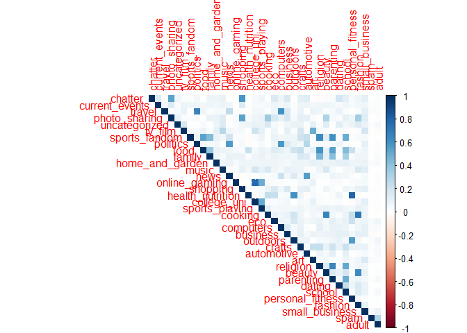
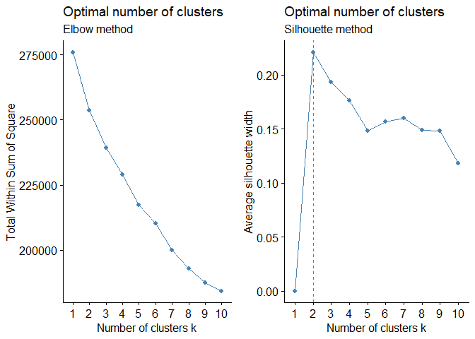
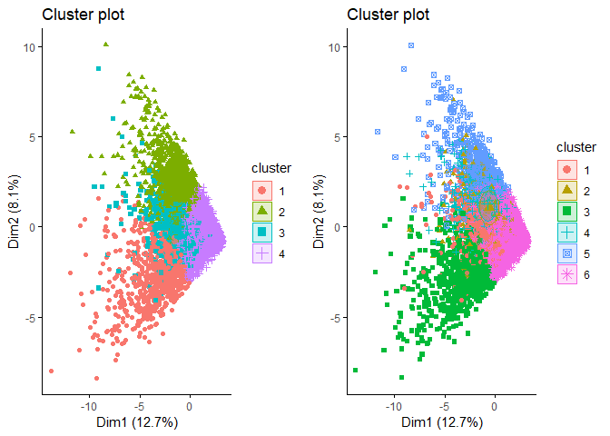

### Market Segmentation

Market Segmentation has always been the first step in any product
launch, campaign or personalized recommendation. This was data collected
in the course of a market-research study using followers of the Twitter
account of a large consumer brand that shall remain nameless---let's
call it "NutrientH20" just to have a label. The goal here was for
NutrientH20 to understand its social-media audience a little bit better,
so that it could hone its messaging a little more sharply.

A bit of background on the data collection: the advertising firm who
runs NutrientH20's online-advertising campaigns took a sample of the
brand's Twitter followers. They collected every Twitter post ("tweet")
by each of those followers over a seven-day period in June 2014. Every
post was examined by a human annotator contracted through Amazon's
Mechanical Turk service.

Each tweet was categorized based on its content using a pre-specified
scheme of 36 different categories, each representing a broad area of
interest (e.g. politics, sports, family, etc.) Annotators were allowed
to classify a post as belonging to more than one category. For example,
a hypothetical post such as "I'm really excited to see grandpa go wreck
shop in his geriatic soccer league this Sunday!" might be categorized as
both "family" and "sports." You get the picture.

With this introduction about the data, lets move forward with our
analysis of finding the profiles of the customers that the brand has!

#### Analysis:

**Objective:** To create market segments based on the user interests and
identify the profiles of those segments  
Step 1: Explore the data for correlated interests  
Step 2: Normalize the data and perform clustering  
Step 3: Profile the clusters after k-means clustering

##### Step1: Explore the data for correlated interests based on the tweets

    library(tidyverse)  # data manipulation
    library(cluster)    # clustering algorithms
    library(factoextra)
    library(NbClust)
    library(corrplot)
    library(gridExtra)

    scl_data = read.csv('social_marketing.csv',na.strings = '')
    str(scl_data)

    ## 'data.frame':    7882 obs. of  37 variables:
    ##  $ X               : Factor w/ 7882 levels "123pxkyqj","12grikctu",..: 3720 2540 4096 596 3197 3609 4749 6518 7418 4917 ...
    ##  $ chatter         : int  2 3 6 1 5 6 1 5 6 5 ...
    ##  $ current_events  : int  0 3 3 5 2 4 2 3 2 2 ...
    ##  $ travel          : int  2 2 4 2 0 2 7 3 0 4 ...
    ##  $ photo_sharing   : int  2 1 3 2 6 7 1 6 1 4 ...
    ##  $ uncategorized   : int  2 1 1 0 1 0 0 1 0 0 ...
    ##  $ tv_film         : int  1 1 5 1 0 1 1 1 0 5 ...
    ##  $ sports_fandom   : int  1 4 0 0 0 1 1 1 0 9 ...
    ##  $ politics        : int  0 1 2 1 2 0 11 0 0 1 ...
    ##  $ food            : int  4 2 1 0 0 2 1 0 2 5 ...
    ##  $ family          : int  1 2 1 1 1 1 0 0 2 4 ...
    ##  $ home_and_garden : int  2 1 1 0 0 1 0 0 1 0 ...
    ##  $ music           : int  0 0 1 0 0 1 0 2 1 1 ...
    ##  $ news            : int  0 0 1 0 0 0 1 0 0 0 ...
    ##  $ online_gaming   : int  0 0 0 0 3 0 0 1 2 1 ...
    ##  $ shopping        : int  1 0 2 0 2 5 1 3 0 0 ...
    ##  $ health_nutrition: int  17 0 0 0 0 0 1 1 22 7 ...
    ##  $ college_uni     : int  0 0 0 1 4 0 1 0 1 4 ...
    ##  $ sports_playing  : int  2 1 0 0 0 0 1 0 0 1 ...
    ##  $ cooking         : int  5 0 2 0 1 0 1 10 5 4 ...
    ##  $ eco             : int  1 0 1 0 0 0 0 0 2 1 ...
    ##  $ computers       : int  1 0 0 0 1 1 1 1 1 2 ...
    ##  $ business        : int  0 1 0 1 0 1 3 0 1 0 ...
    ##  $ outdoors        : int  2 0 0 0 1 0 1 0 3 0 ...
    ##  $ crafts          : int  1 2 2 3 0 0 0 1 0 0 ...
    ##  $ automotive      : int  0 0 0 0 0 1 0 1 0 4 ...
    ##  $ art             : int  0 0 8 2 0 0 1 0 1 0 ...
    ##  $ religion        : int  1 0 0 0 0 0 1 0 0 13 ...
    ##  $ beauty          : int  0 0 1 1 0 0 0 5 5 1 ...
    ##  $ parenting       : int  1 0 0 0 0 0 0 1 0 3 ...
    ##  $ dating          : int  1 1 1 0 0 0 0 0 0 0 ...
    ##  $ school          : int  0 4 0 0 0 0 0 0 1 3 ...
    ##  $ personal_fitness: int  11 0 0 0 0 0 0 0 12 2 ...
    ##  $ fashion         : int  0 0 1 0 0 0 0 4 3 1 ...
    ##  $ small_business  : int  0 0 0 0 1 0 0 0 1 0 ...
    ##  $ spam            : int  0 0 0 0 0 0 0 0 0 0 ...
    ##  $ adult           : int  0 0 0 0 0 0 0 0 0 0 ...

    #Removing the labels from the data
    cormat <- cor(scl_data[c(2:37)])
    corrplot(cormat,method = 'shade',type = 'upper')

**Findings:**

-   Shopping and photo-sharing are positively correlated  
-   College\_uni and online\_gaming stands out with a strong positive
    correlation  
-   Health\_nutrition,peronal\_fitness and outdoors have a high positive
    correlation showing these people are health conscious  
-   Fashion and beauty have a strong postive correlation

There are more number of such combinations. Let's perform cluster
analysis to gain more insights into the profiles.  
We can include all the variables in the cluster analysis as
multicorrelation has a little effect on the clusters formed.

##### Step 2: Normalize the data and perform clustering

Lets run k-means clustering and hierarchical clustering to come with the
profiles and if the results are comparable

**k-means clustering** Assuming that you know the basics of k-means
clustering, i am moving forward with the analysis. First lets
standardize the variables as it is important while calculating the
distance to have the variables at a uniform scale.

    # Standardizing the variables before clustering
    scl_scaled <- scale(scl_data[,3:37], center=TRUE, scale=TRUE)

    # Extract the centers and scales from the rescaled data (which are named attributes)
    mu = attr(scl_scaled,"scaled:center")
    sigma = attr(scl_scaled,"scaled:scale")

One question that arises during k-means clustering is about how many
clusters that we have to consider. Lets plot a scree plot(elbow curve)
[scree
plot](https://www.r-bloggers.com/finding-optimal-number-of-clusters/)

    # Elbow method
    wss = fviz_nbclust(scl_scaled, kmeans, method = "wss") +
      labs(subtitle = "Elbow method")

    # Silhouette method
    sil = fviz_nbclust(scl_scaled, kmeans, method = "silhouette")+
      labs(subtitle = "Silhouette method")

    grid.arrange(wss,sil,ncol = 2) 

Here the elbow curve is not of much help, let consider 6 as the optimal
number of clusters and see if we can find convincing profiles.
Otherwise, we can repeat the process with a different number fo
clusters.

Even silhouette width gives a marginal 2 clusters which might not work
out for us in the practical scenario as we will need more number of
clusters.

    # 4 clusters
    set.seed(4)
    clust4 = kmeans(scl_scaled, 4, nstart=25)

    # Visualizing the clusters on a dimensionally reduced plot
    clus4plot = fviz_cluster(clust4, data = scl_scaled, 
                 ellipse.type = "euclid", # Concentration ellipse
                 ggtheme = theme_classic(),geom = c("point")
                 )

    # 6 clusters
    set.seed(4)
    clust6 = kmeans(scl_scaled, 6, nstart=25)
    # Visualizing the clusters on a dimensionally reduced plot
    clus6plot = fviz_cluster(clust6, data = scl_scaled, 
                 ellipse.type = "euclid", # Concentration ellipse
                 ggtheme = theme_classic(),geom = c("point")
                 )
    grid.arrange(clus4plot,clus6plot,ncol = 2)

Lets go with 6 clusters as it is often better to have more segments in
market segmentation htan to club multiple profiles under one segment

We have reached the final step in our analysis "Profiling each
cluster".Lets take the mean number of tweets under each cluster and look
into the interests that the people in a particular segment are tweeting
about the most.

    res = aggregate(scl_data, by=list(cluster=clust6$cluster), mean)

    # Dropping the chatter column adn other unnecessary columns
    results1 = res[,-c(2,3)]
    results1 = as.data.frame(results1)

    # transpose
    t_results1 <- t(results1)

    # get row and colnames in order
    colnames(t_results1) <- rownames(results1)
    rownames(t_results1) <- colnames(results1)

    # REmoving cluster names
    t_results2 = t_results1[-1,]

    k = colnames(t_results2)[apply(t_results2,1,which.max)]
    clus_features = cbind(rownames(t_results2),k)

    # Lets find the features for which the people in a particular segment have made the maximum number of tweets on average

    #Steps pending
    # Find the features for each cluster by max mean
    # Conclude
    # Move on to hierarchical clustering

We can observe a distinct profile for each cluster based on the
frequency of the posts of a particular interest in comparison to the
mean of other clusters  
All clusters except cluster 6 have distinct features.As the primary
objective is to identify the different market segments to come up with
the marketing campaign, 5 clusters would help us achieve our objective.

Finally, following is the summary of the segments that we obtained
through clustering:

**Highly educated adults - (Cluster 1) :** These people showed an
interest in travelling, politics, news and dating through their tweets.

**In door entertainment enthusiasts - (Cluster 2):** These people showed
their interest in inddor entertainment like tv, art, film,computer games
and online gaming

**Family people - (Cluster 3):** People in this cluster showed an
interest in family,parenting, home-garden, school etc through their
tweets

**Fitness enthusiasts - (Cluster 4):** This is an interesting segement
for the nutrition company as these are the people who are interested in
staying fit through outdoor activites,health-nutrition and
personal-fitness exercises

**Social media people - (Cluster 5):** These are the people who showed
most interest in photo-sharing and are interested in cooking, beauty
,current-events and fashion

End
---
